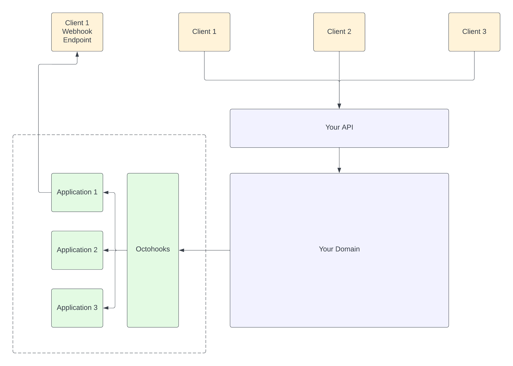

# Octohooks.Example

## Introduction



## Install

Install the library

```bash
dotnet add package Octohooks.net
```

## Configure

Configure the Octhooks Client

```csharp
builder.Services
    .AddTransient((serviceProvider) => new OctohooksClient("AUTH_TOKEN"));
```

## Implement

````csharp
[HttpPost]
public async Task<IActionResult> Post(MessagesPostRequest request)
{
    // Your application ID is either the ID assigned by the system or a custom ID chosen by you.
    // Creating an application for each user is advisable, and acquiring the application ID can be done through the Auth Token, JWT, headers, or a personalized approach.
    var applicationId = GetApplicationIdFromToken();

    // Here you can implement your own logic. For instance, we are sending an SMS in this example.
    var message = await _messageService.SendSms(request.MobileNumber, request.Body);

    // Making a request to Octohooks
    await _octohooksClient.Message.Create(applicationId, new MessageRequest
    {
        Channels = new string[] { },
        EventType = "message.sent",
        Payload = message,
        Uid = message.Id.ToString(),
    });

    return Accepted();
}
```
