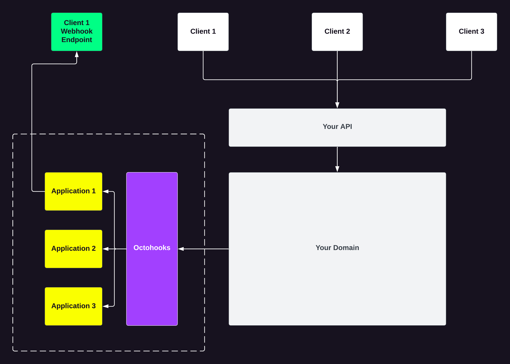

# Octohooks.Example

## Introduction

In this scenario, there is a .NET Core API which enables merchants to initiate refunds through an endpoint. As per the request from merchants, there is a need to introduce webhook functionality for receiving instantaneous notifications about the initiation and processing of refunds.

To achieve this objective, we plan to leverage [Octohooks](https://octohooks.com) for adding webhook capabilities to our API. The proposed approach entails generating an individual application for each merchant in [Octohooks](https://octohooks.com), thereby enabling each merchant to specify one or more endpoints for receiving events/messages.



## Install

Install the .NET Core library on your project or solution.

```bash
dotnet add package Octohooks.net
```

## Setup

Register the `OctohooksClient` with your dependency injection container.

```csharp
builder.Services
    .AddTransient((serviceProvider) => new OctohooksClient("AUTH_TOKEN"));
```

## Implement

- Ensure the required `using` statements are added to your file.
- Declare the `OctohooksClient` field in your controller `class`.
- Assign the `OctohooksClient` field in the constructor of your controller `class`.
- Use the `OctohooksClient` instance to make a request to [Octohooks](https://octohooks.com) in your controller method(s).

````csharp
using Octohooks.net;
using Octohooks.net.Requests;

[ApiController]
[Route("api/[controller]")]
public class RefundsController : ControllerBase
{
    private readonly OctohooksClient _octohooksClient;

    public RefundsController(OctohooksClient octohooksClient)
    {
        _octohooksClient = octohooksClient ?? throw new ArgumentNullException(nameof(octohooksClient));
    }

    [HttpPost]
    public async Task<IActionResult> Post(string id)
    {
        // We'll use the JSON Web Token(JWT) to determine the applicationId of the client making the request
        var applicationId = GetApplicationIdFromToken();

        // Initiate refund via our domain service
        var transaction = await _refundsService.Initiate(id);

        // Making a request to Octohooks to send the event/message
        await _octohooksClient.Message.Create(applicationId, new MessageRequest
        {
            Channels = new string[] { },
            EventType = "refund.pending",
            Payload = transaction,
            Uid = transaction.Id.ToString(),
        });

        return Ok(transaction);
    }
}
```
````
